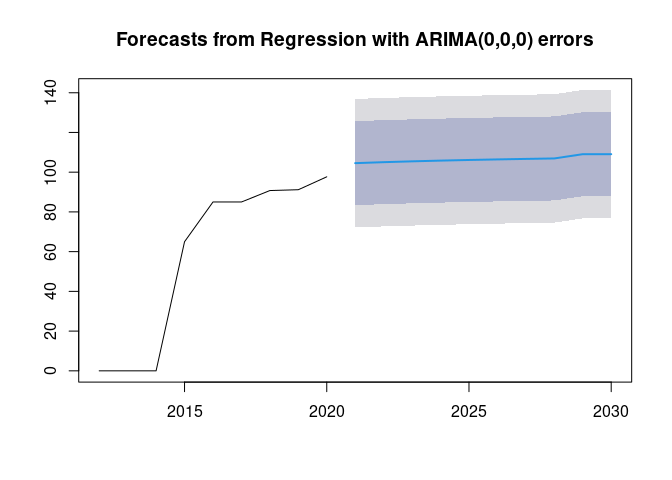
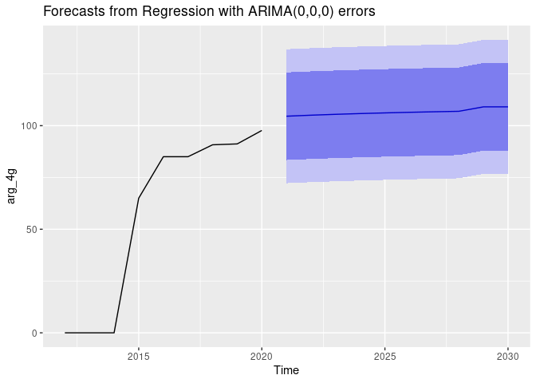

Euromonitor International Coding Task
================
Said Maanan
2022-08-04

## Loading Data

Since the data in the **wimax raw data.csv** file contains too few
observations to allow us to confidently perform the analysis, we decided
to obtain new data from the ITU website.

``` r
library(tidyverse)
library(readxl)
library(tidyr)
library(dplyr)
library(readr)
library(purrr)
```

``` r
ddd_dataset <- read_excel("data/ddd_dataset.xlsx")
new_data = ddd_dataset[ddd_dataset$`Indicator name`=="Population covered by at least a 4G mobile network (%)",]
```

``` r
head(new_data)
```

    ## # A tibble: 6 × 7
    ##   Country           Region ISO   `Indicator name`     Year Value `ITU estimate?`
    ##   <chr>             <chr>  <chr> <chr>               <dbl> <chr> <chr>          
    ## 1 Burundi           Africa BDI   Population covered…  2012 0     <NA>           
    ## 2 Equatorial Guinea Africa GNQ   Population covered…  2012 NULL  <NA>           
    ## 3 Guinea            Africa GIN   Population covered…  2012 NULL  <NA>           
    ## 4 Mali              Africa MLI   Population covered…  2012 NULL  <NA>           
    ## 5 Mauritius         Africa MUS   Population covered…  2012 16.25 Yes            
    ## 6 Mozambique        Africa MOZ   Population covered…  2012 NULL  <NA>

## Data Cleaning

We will remove excess columns, turn the years into columns, and sort the
data by country.

``` r
new_data = new_data[order(new_data$Country),]
new_data = new_data[-c(1553, 1554), c(1,5,6)]
new_data = spread(new_data, Year, value = Value)
```

``` r
head(new_data)
```

    ## # A tibble: 6 × 10
    ##   Country         `2012` `2013` `2014` `2015` `2016` `2017` `2018` `2019` `2020`
    ##   <chr>           <chr>  <chr>  <chr>  <chr>  <chr>  <chr>  <chr>  <chr>  <chr> 
    ## 1 Afghanistan     NULL   NULL   0      0      0      4      7      22     26    
    ## 2 Albania         <NA>   <NA>   0      35     80.2   85.3   85.5   95     98.38 
    ## 3 Algeria         0      0      0      0      3.62   30.49  52.84  53.63  76.18…
    ## 4 Andorra         <NA>   <NA>   NULL   50     50     85     85     85     85    
    ## 5 Angola          <NA>   NULL   NULL   7      8      8      8      18     30    
    ## 6 Antigua and Ba… 65     78.59… 80     98     99     99     <NA>   99     99

We can see that for most countries, there are many values cells with
values `NA` or `NULL`. Therefore we will need to do data imputation for
the missing data.

## Data Imputation

``` r
new_data = new_data %>% pivot_longer(-Country, names_to = "year") %>% 
  mutate(value = value %>% as.numeric()) %>% 
  group_by(Country) %>% 
  fill(value, .direction = "updown") %>% 
  pivot_wider(names_from = year, values_from = value)

new_data
```

    ## # A tibble: 196 × 10
    ## # Groups:   Country [196]
    ##    Country        `2012` `2013` `2014` `2015` `2016` `2017` `2018` `2019` `2020`
    ##    <chr>           <dbl>  <dbl>  <dbl>  <dbl>  <dbl>  <dbl>  <dbl>  <dbl>  <dbl>
    ##  1 Afghanistan       0      0        0    0     0       4      7     22     26  
    ##  2 Albania           0      0        0   35    80.2    85.3   85.5   95     98.4
    ##  3 Algeria           0      0        0    0     3.62   30.5   52.8   53.6   76.2
    ##  4 Andorra          50     50       50   50    50      85     85     85     85  
    ##  5 Angola            7      7        7    7     8       8      8     18     30  
    ##  6 Antigua and B…   65     78.6     80   98    99      99     99     99     99  
    ##  7 Argentina         0      0        0   65    85      85     90.8   91.2   97.7
    ##  8 Armenia          17.5   44       46   46.5  52.5    90.0   99.1   99.3  100  
    ##  9 Australia        52.2   85       95   94    98      99     99.2   99.4   99.5
    ## 10 Austria          31.6   58.4     85   98    98      98     98     98     98  
    ## # … with 186 more rows

After imputing the data, there are no more missing values.

## Modelling

After imputing the data, we will now create the model that will allow us
to predict the future values of LTE coverage rate, but this process will
go through different steps, the first one will be to standardize the
country names:

``` r
itu_emi_countries <- read_csv("data/itu-emi-countries.csv")
itu_emi_countries <- itu_emi_countries %>% rename(Country = `ITU Name`)
new_data = left_join(new_data, itu_emi_countries, by.x = "Country", by.y = "Country")
new_data$Country = new_data$`EMI Name`
new_data = new_data[,1:10]
```

We will then proceed to convert the main data set into long format, as
this will make the data handy for the analysis.

``` r
new_long = 
  new_data %>% 
  pivot_longer(-Country, names_to = "year", values_to = "x") %>% 
  mutate(across(year, as.numeric))
```

And we will load the data related to 3G coverage, and will split it into
two parts, one for building the model, the other for making the
predictions.

``` r
X3g_data <- read_csv("data/3g data.csv")

train_data = X3g_data[,c(1, 42:50)]
test_data  = X3g_data[,c(1, 51:60)]
```

The part that will go into building the model will also be shaped into
long format.

``` r
train_long = 
  train_data %>% 
  select(CountryName, starts_with("Y")) %>% 
  pivot_longer(-CountryName, names_to = "year", values_to = "y") %>% 
  mutate(year = as.numeric(gsub("^Y", "", year)))

names(train_long)[1] = "Country"
```

Then we join both long data sets into one:

``` r
data_long = inner_join(new_long, train_long, by = c("Country","year"))
```

And we build our model:

``` r
data_long_nested = 
  data_long %>% 
  group_by(Country) %>% 
  nest() %>% 
  rowwise() %>% 
  mutate(model = list(lm(x ~ y, data = data))) %>% 
  ungroup()
```

The model is row-wise, i.e. it efficiently built a model for each
country at the same time. This can be seen here (example with Albania):

``` r
head(data_long_nested)
```

    ## # A tibble: 6 × 3
    ##   Country   data             model 
    ##   <chr>     <list>           <list>
    ## 1 Albania   <tibble [9 × 3]> <lm>  
    ## 2 Algeria   <tibble [9 × 3]> <lm>  
    ## 3 Angola    <tibble [9 × 3]> <lm>  
    ## 4 Argentina <tibble [9 × 3]> <lm>  
    ## 5 Armenia   <tibble [9 × 3]> <lm>  
    ## 6 Australia <tibble [9 × 3]> <lm>

``` r
data_long_nested$data[[1]]
```

    ## # A tibble: 9 × 3
    ##    year     x     y
    ##   <dbl> <dbl> <dbl>
    ## 1  2012   0      99
    ## 2  2013   0      99
    ## 3  2014   0      99
    ## 4  2015  35      99
    ## 5  2016  80.2   100
    ## 6  2017  85.3   100
    ## 7  2018  85.5   100
    ## 8  2019  95     100
    ## 9  2020  98.4   100

``` r
data_long_nested$model[[1]]
```

    ## 
    ## Call:
    ## lm(formula = x ~ y, data = data)
    ## 
    ## Coefficients:
    ## (Intercept)            y  
    ##    -7923.72        80.13

## Forecasting

The model we created will be very useful for us for the purpose of
making predictions, and for this we will use the `test_data` which
contained the future values of 3G.

``` r
names(test_data)[1] = "Country"

predict = test_data %>%
  select(Country, starts_with("Y")) %>%
  pivot_longer(-Country, names_to = "year", values_to = "y") %>%
  mutate(year = as.numeric(gsub("^Y", "", year))) %>%
  group_by(Country) %>% 
  nest() %>% 
  rename(pred_data = data) %>% 
  inner_join(data_long_nested) %>% 
  mutate(
    prediction = map2(.x = model, .y = pred_data, predict)
  )

print(predict)
```

    ## # A tibble: 124 × 5
    ## # Groups:   Country [124]
    ##    Country    pred_data         data             model  prediction
    ##    <chr>      <list>            <list>           <list> <list>    
    ##  1 Albania    <tibble [10 × 2]> <tibble [9 × 3]> <lm>   <dbl [10]>
    ##  2 Angola     <tibble [10 × 2]> <tibble [9 × 3]> <lm>   <dbl [10]>
    ##  3 Azerbaijan <tibble [10 × 2]> <tibble [9 × 3]> <lm>   <dbl [10]>
    ##  4 Algeria    <tibble [10 × 2]> <tibble [9 × 3]> <lm>   <dbl [10]>
    ##  5 Armenia    <tibble [10 × 2]> <tibble [9 × 3]> <lm>   <dbl [10]>
    ##  6 Laos       <tibble [10 × 2]> <tibble [9 × 3]> <lm>   <dbl [10]>
    ##  7 Argentina  <tibble [10 × 2]> <tibble [9 × 3]> <lm>   <dbl [10]>
    ##  8 Austria    <tibble [10 × 2]> <tibble [9 × 3]> <lm>   <dbl [10]>
    ##  9 Australia  <tibble [10 × 2]> <tibble [9 × 3]> <lm>   <dbl [10]>
    ## 10 Barbados   <tibble [10 × 2]> <tibble [9 × 3]> <lm>   <dbl [10]>
    ## # … with 114 more rows

``` r
predict$prediction[[1]]
```

    ##      1      2      3      4      5      6      7      8      9     10 
    ## 88.876 88.876 88.876 88.876 88.876 88.876 88.876 88.876 88.876 88.876

## Put Results in CSV File

First we gather the data we want,

``` r
unnested = unnest(predict, prediction)

unnested = unnested[, c(1, 5)]

unnested = data.frame(Country = unnested$Country, Preds = unnested$prediction, Year = rep(2021:2030, times = 124))

unnested = spread(unnested, Year, value = Preds)

extradat = X3g_data[,c("CountryName","CountryCode","CountryCodeID","ProductID","ProductName","Unit")]

unnested = left_join(unnested, extradat, by = c("Country" = "CountryName"), all.x = TRUE)

unnested = left_join(unnested, new_data, by = "Country", all.x = TRUE)

unnested = unnested[, c(1, 12:25, 2:11)]
```

We need to remove the data that is unwanted.

``` r
exceptions <- read_csv("data/WiMAX exceptions.csv")

exceptions = exceptions[-c(10, 14), c(1, 3)]

exceptions$Years = gsub('Y','', exceptions$Years)

Count = exceptions$CountryName

Year  = exceptions$Years

for (i in seq_along(Count)) {
  unnested[unnested$Country == Count[i], ][[Year[i]]] <- NA
}
```

We can now save the data.

``` r
write.csv(unnested, "result.csv", row.names = FALSE)
```

## Time Series Method

Above we used simple regression because it allowed us to run row-wise
through all the countries without using a loop, which is very efficient.
However we know the data is a time series, and should be treated as
such. Here we will analyze some of the countries’ data as time series.

``` r
library(forecast)

arg    = data_long[data_long$Country=="Argentina",]

arg_3g = ts(arg$y, frequency = 1, start = 2012)

arg_4g = ts(arg$x, frequency = 1, start = 2012)

arg_nu = ts(predict$pred_data[[7]]$y, frequency = 1, start = 2021)

fit <- auto.arima(arg_4g, xreg = arg_3g)

forecast <- forecast(fit, xreg = arg_nu)

plot(forecast)
```

<!-- -->

``` r
autoplot(forecast)
```

<!-- -->

As one can see, the forecast is clearly incorrect since it goes above
100, which is wrong, but this due to the fact that we did not have
enough time to build the model properly.
